# 🗺️ Diagrama de Base de Datos - Thiart 3D

## Diagrama de Relaciones (Mermaid)

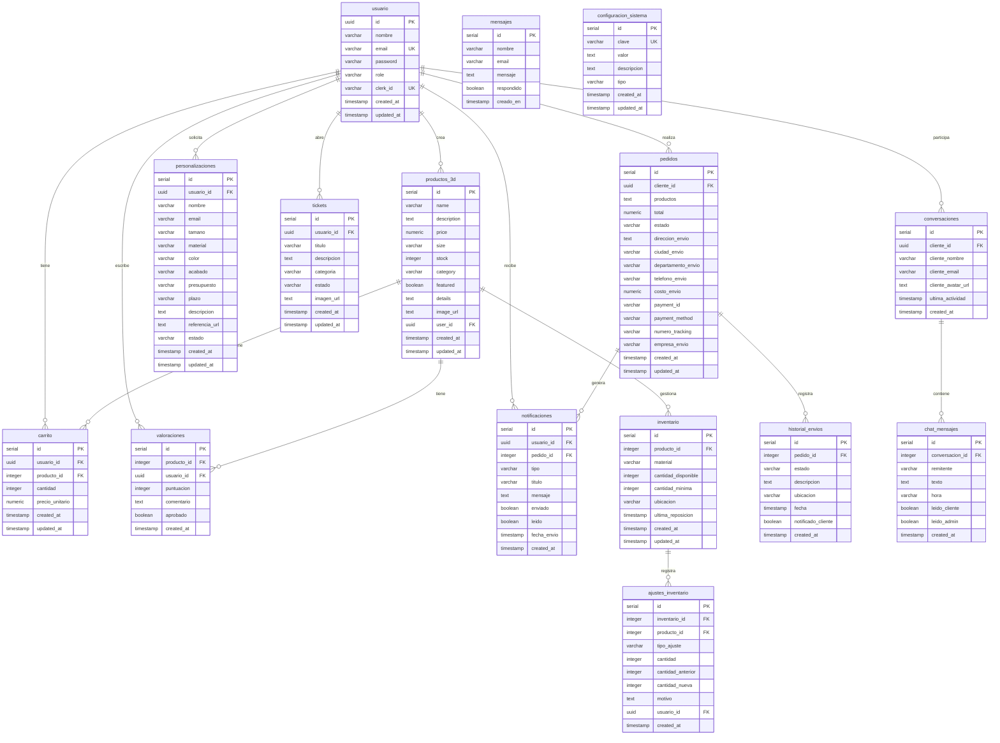

## Diagrama de Flujos Principales

### Flujo de Compra

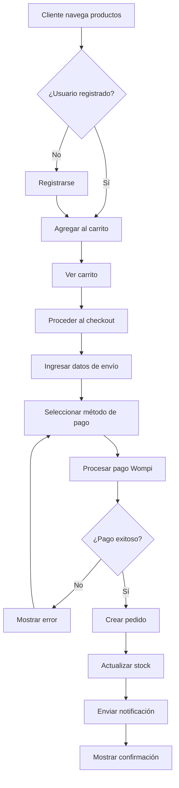

### Flujo de Tracking

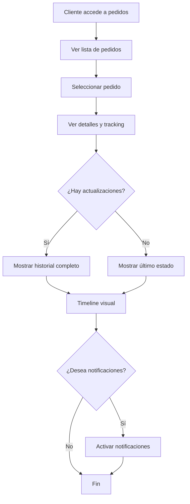

### Flujo de Personalización

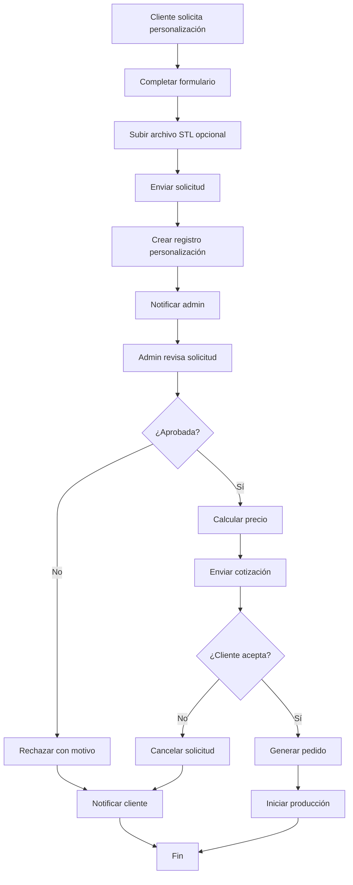

### Flujo de Tickets

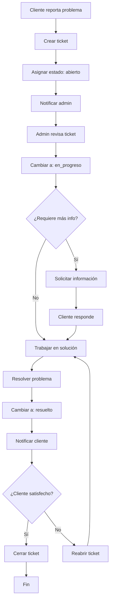

### Flujo de Chat

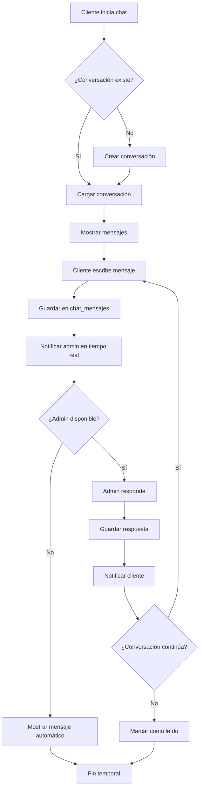

## Diagrama de Estados

### Estados de Pedidos

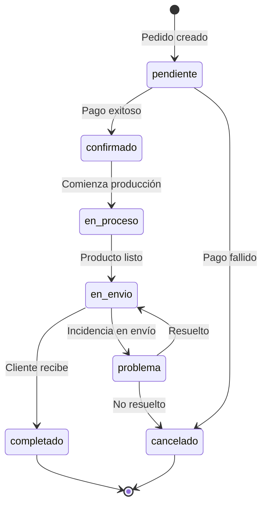

### Estados de Tickets

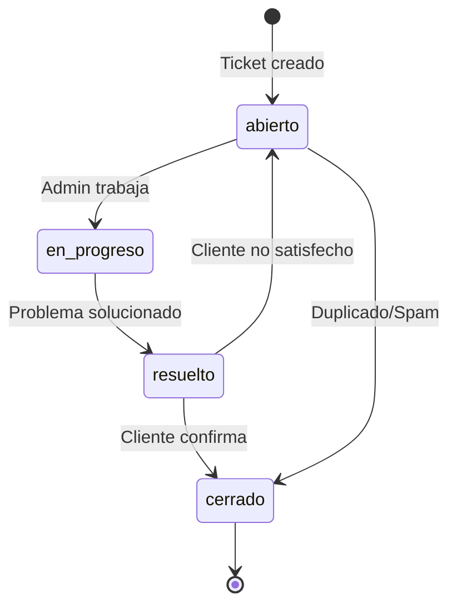

### Estados de Personalización

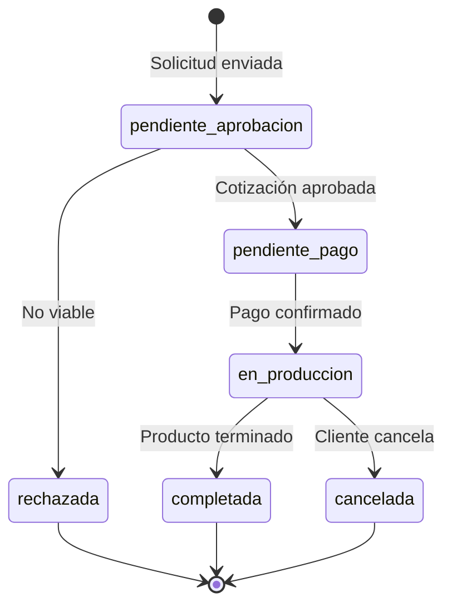

## Arquitectura de Seguridad (RLS)

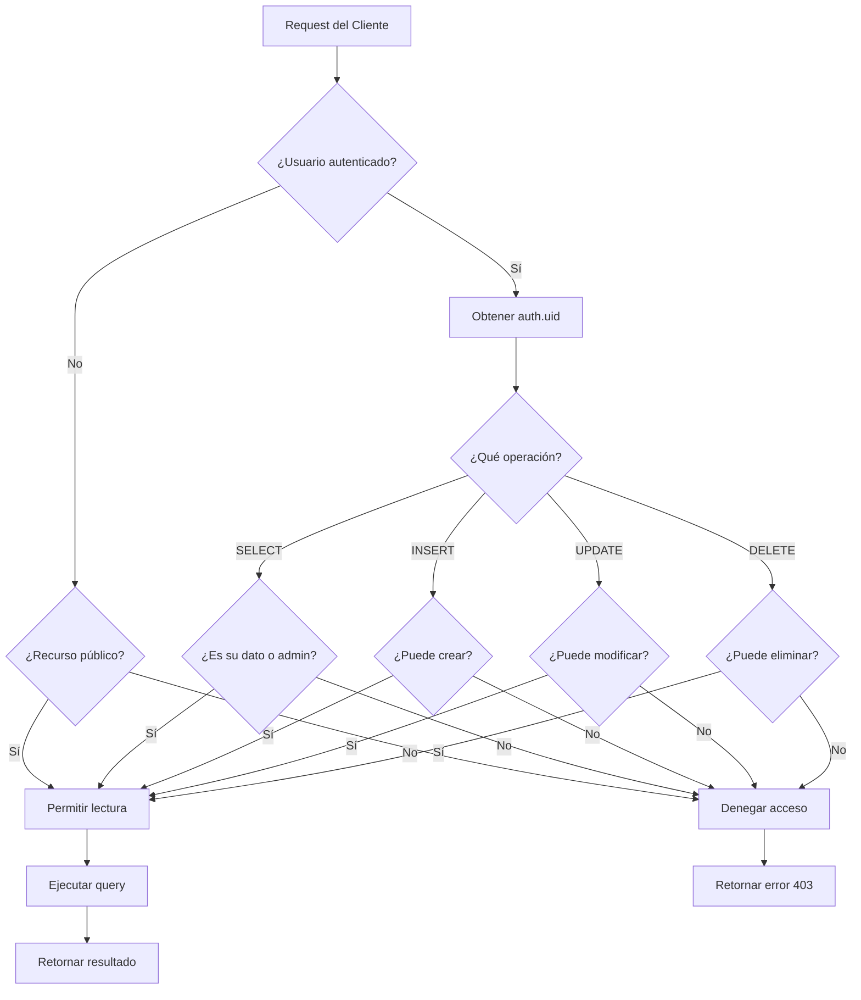

## Diagrama de Integración

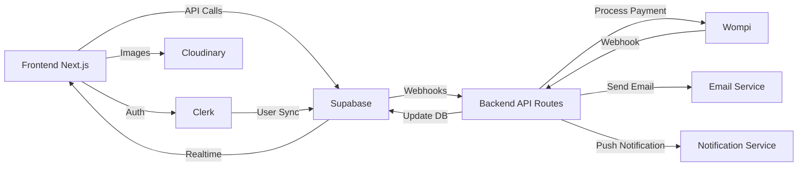

## Diagrama de Mantenimiento

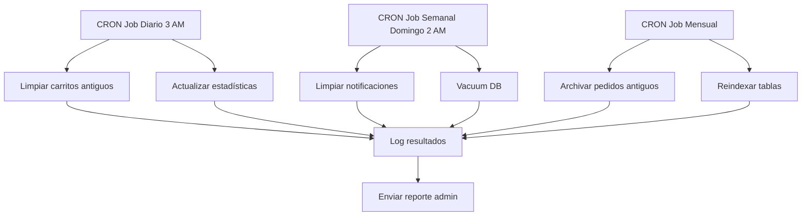

## Índice de Consultas Frecuentes

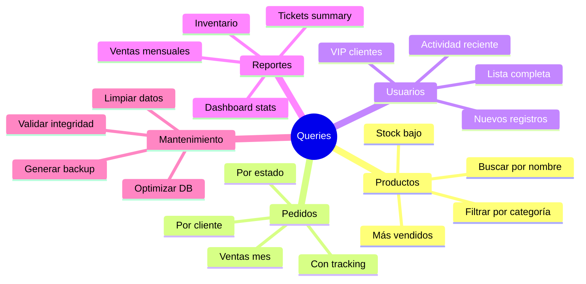

---

## Notas sobre los Diagramas

### Cómo visualizar
1. **En GitHub**: Los diagramas Mermaid se renderizan automáticamente
2. **En VS Code**: Instala la extensión "Markdown Preview Mermaid Support"
3. **Online**: Copia el código a [mermaid.live](https://mermaid.live)

### Convenciones
- **PK**: Primary Key (Clave Primaria)
- **FK**: Foreign Key (Clave Foránea)
- **UK**: Unique Key (Clave Única)
- `||--o{`: Relación uno a muchos
- `||--||`: Relación uno a uno

---

**Versión:** 1.0.0  
**Fecha:** Noviembre 2025  
**Proyecto:** Thiart 3D
